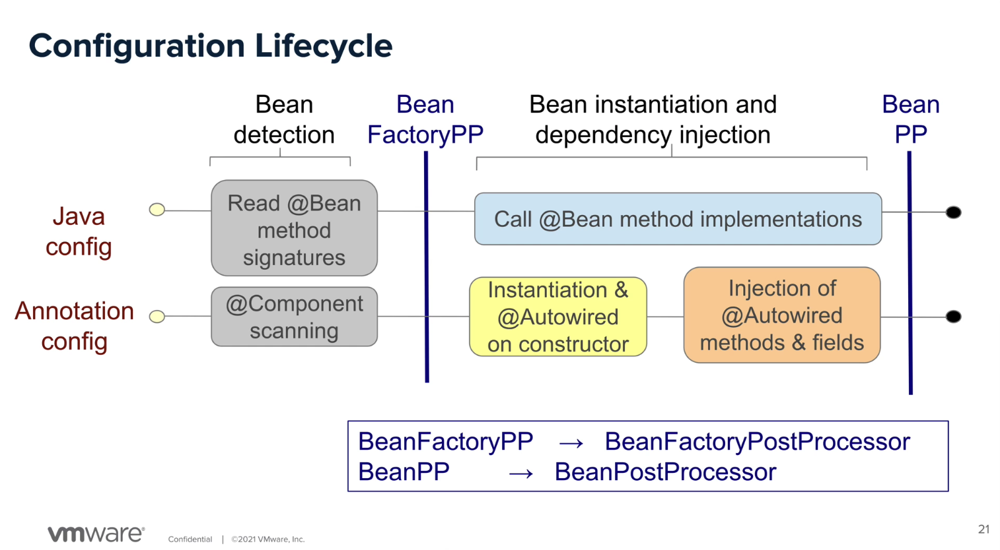

Baseado no [Inside the Spring Container > Initialization Phase (Part 2)](https://spring.academy/courses/spring-framework-essentials/lessons/spring-essentials-spring-container-initialization-2)



A idéia é explorar os limites e entender o ciclo de vida.

Ponto 0: 

Com o AppConfig, UserService, e Main, o App compila sem problemas.

Não estamos usando nada do spring, muito menos os beans. Então as classes só estão no mesmo package.

Ponto 1:

```java
UserService service = context.getBean(UserService.class);
```

Para o Spring registrar o UserService automaticamente, pode fazer de duas formas:

1 - Via Config

No AppConfig.java eu tenho a instancia via @bean

```java
@Bean
public UserService userService() {
    return new UserService();
}
```

Spring -> Encontra AppCofig -> executa o @Bean -> Cria o UserService

-------

2 - Via `@ComponentScan` + `@Service`

O Spring vai encontrar o UserService no package por causa da anotação `@Service` que esta no UserService.

Caso contrário ( sem a anotação ), daria `NoSuchBeanDefinitionException`:

```bash
Exception in thread "main" org.springframework.beans.factory.NoSuchBeanDefinitionException: No qualifying bean of type 'com.example.demo.UserService' available
```

OBS:

Se eu combinar o primeiro approach com o segundo, o `@Bean` vai registrar, e não vai registrar novamente o userService.

Agora se eu tiver nomes diferentes, por exemplo:

```java
@Configuration
@ComponentScan("com.example.demo")
class AppConfig {
    @Bean
    public UserService anotherUserService() {
        return new UserService("Teste");
    }
}
```

irá estourar uma exception com `NoUniqueBeanDefinitionException`

Uma forma de resolver isso, esta na [aula anterior](https://spring.academy/courses/spring-framework-essentials/lessons/spring-essentials-component-scanning-lab).

1> Resolve pelo nome

```java
UserService service = context.getBean("userService", UserService.class);
UserService service2 = context.getBean("anotherUserService", UserService.class);
```

2> Com @Qualifier

3> Com @Primary

-------

3 - Sem o AppConfig, e fazendo scanning pelo package

```java
var context = new AnnotationConfigApplicationContext("com.example.demo");
```

# SpringBoot Application

Agora explorando com o SpringBoot, o resultado fica mais simples:

```java
package com.example.demo;

import org.springframework.boot.SpringApplication;
import org.springframework.boot.autoconfigure.SpringBootApplication;

@SpringBootApplication
public class Main
{
    public static void main(String[] args)
    {
        var context = SpringApplication.run(Main.class, args);
        UserService service = context.getBean(UserService.class);

        System.out.println(service.name);
        service.hello();
        context.close();
    }
}
```

Os beans são ignorado, se não estiverem dentro de uma classe de configuração. Por que o Spring não sai procurando beans em tudo que é classe.

```java
class UserService {
 ...
    // Isto será ignorado
    @Bean
    public static UserService failedUserService() {
        return new UserService("Failed");
    }
}
```

O Spring procura components tipo:

@Service, @Component, @Repository, @Controller

------

# Experimento 2

## Bean depender do outro

O Spring fornece a injeção automagicamente.

```java
// Imports ommited...

// AppConfig.java
@Configuration
class AppConfig {

    @Bean
    UserService userService(EmailService emailService) {
        System.out.println("UserService Created");
        return new UserService(emailService);
    }

    @Bean
    EmailService emailService() {
        System.out.println("EmailService Created");
        return new EmailService();
    }
}

// UserService.java
class UserService {
    public UserService(EmailService emailService) {
        System.out.println("UserService instance");
        emailService.hello();
    }

    public void hello() {
        System.out.println("Oi");
    }
}

// EmailService.java
public class EmailService {
    public void hello() {
        System.out.println("Oi do email");
    }
}
```

Podemos simplificar para:


```java
// Imports ommited...

// AppConfig.java
@Configuration
class AppConfig {
}

// UserService.java
@Service
class UserService {
    public UserService(EmailService emailService) {
        System.out.println("UserService instance");
        emailService.hello();
    }

    public void hello() {
        System.out.println("Oi");
    }
}

// EmailService.java
@Service
public class EmailService {
    public void hello() {
        System.out.println("Oi do email");
    }
}
```

Vai funcionar igual.

# Injections of methods & fields


Baseado no experimento anterior, podemos injetar diretamente os campos:

Podemos provar que na caixa amarela, primeiro se executa os construtores, e depois o @Autowired

```java
package com.example.demo;

import jakarta.annotation.PostConstruct;
import org.springframework.beans.factory.annotation.Autowired;
import org.springframework.stereotype.Service;

@Service
class UserService {

    @Autowired
    EmailService emailService;

    public UserService() {
        System.out.println(emailService); // null
        System.out.println("UserService instance");
    }

    @PostConstruct
    public void init() {
        // Autowired é injetado após o construtor
        // com.example.demo.EmailService@2d8f2f3a
        System.out.println(emailService);
    }

    public void hello() {
        System.out.println("Oi");
    }
}
```